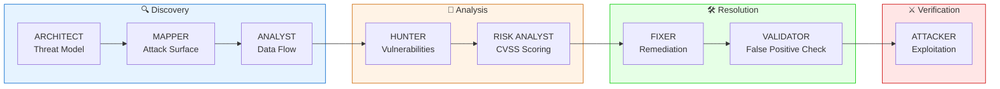

<div align="center">

# 🔍 Agentic Security Code Review

[](https://claude.ai/code)
[](https://owasp.org/Top10/)
[]()
[](LICENSE)

**A structured, multi-agent approach to AI-assisted application security reviews — moving beyond generic scans to depth-first vulnerability analysis.**

</div>

---

## 📌 Project Overview

This project demonstrates how to use **Claude Code as an agentic security review system** — not as a simple chatbot, but as a coordinated team of specialized security analysts.

Instead of asking AI to "do a security review" (which produces vague, generic output), this approach breaks the problem into **8 specialized sub-agents**, each responsible for a specific phase of the assessment. The result is a structured, high-confidence security report with real file paths, line numbers, and exploitation scenarios.

> **The problem I solved:** Most AI-assisted security reviews fail because they treat complex analysis as a single prompt. This project applies the same methodology used by professional AppSec teams — decomposing the review into architecture analysis, attack surface mapping, data flow tracing, and adversarial simulation.

<br>

<p align="center">
  
</p>

<p align="center"><em>8 specialized agents working in sequence: Architecture → Attack Surface → Data Flow → Vulnerabilities → Risk → Remediation → Validation → Exploitation</em></p>

---

## 🎯 Why I Built This

As a security professional, I noticed a pattern:

- **Generic AI prompts** produce generic security advice — no file references, no line numbers, no proof of exploitability
- **Real security reviews** follow a structured methodology — threat modeling, attack surface analysis, code path tracing
- **The gap** is in how we prompt AI systems — treating them as chatbots instead of orchestrated analysis tools

This project bridges that gap by applying **agentic AI principles** to application security:

| Traditional AI Prompt | Agentic Approach |
|-----------------------|------------------|
| "Review this code for security issues" | 8 specialized agents with defined roles |
| Generic OWASP checklist output | Specific findings with file/line/function |
| No validation of findings | Built-in false positive elimination |
| Theoretical risks | Step-by-step exploitation scenarios |

---

## 🛠️ Tech Stack

<p align="center">
  
  
  
  
  
</p>

---

## 🏗️ The 8-Agent Pipeline

Each agent has a specialized role, and each agent's output feeds the next:



### Agent Responsibilities

| Agent | Role | Output |
|-------|------|--------|
| **ARCHITECT** | Architecture & threat model | Trust boundaries, security assumptions, sensitive assets |
| **MAPPER** | Attack surface mapping | Entry point inventory with endpoints, parameters, handlers |
| **ANALYST** | Data flow & code path analysis | Step-by-step traces with security observations |
| **HUNTER** | Vulnerability identification | Exploitable findings with file/line/function references |
| **RISK ANALYST** | Severity & impact assessment | CVSS v3.1 scoring table with business impact |
| **FIXER** | Remediation guidance | Vulnerable code → secure replacement |
| **VALIDATOR** | False positive elimination | High-confidence findings only |
| **ATTACKER** | Adversarial simulation | Step-by-step exploitation with payloads |

---

## ⚡ Quick Start

### 1. Clone a target repository

```bash
git clone https://github.com/juice-shop/juice-shop.git
cd juice-shop
```

### 2. Launch Claude Code

```bash
claude
```

### 3. Run the security review prompt

Copy the contents of [`prompts/security-review.md`](prompts/security-review.md) and paste into Claude Code.

### 4. Review the generated report

The system will produce a structured security assessment covering all 8 phases.

---

## 📊 Sample Output

When run against [OWASP Juice Shop](https://github.com/juice-shop/juice-shop), the agent pipeline produces:

<details>
<summary><strong>🏛️ Architecture Overview</strong> (click to expand)</summary>

```
High-Level Architecture:
├── Frontend: Angular SPA (TypeScript)
├── Backend: Express.js REST API (Node.js)
├── Database: SQLite (sequelize ORM)
├── Authentication: JWT-based sessions
└── External: Payment gateway integration

Trust Boundaries:
1. Browser → API (untrusted input crosses here)
2. API → Database (SQL queries constructed here)
3. API → File System (uploads, logs)

Sensitive Assets:
- User credentials (hashed passwords)
- JWT signing secrets
- Payment information
- Admin functionality
```

</details>

<details>
<summary><strong>🎯 Attack Surface</strong> (click to expand)</summary>

| Endpoint | Method | Parameters | Handler | Risk |
|----------|--------|------------|---------|------|
| `/rest/user/login` | POST | email, password | `routes/login.js:23` | Auth bypass |
| `/api/Users` | GET/POST | * | `routes/users.js:15` | IDOR |
| `/rest/products/search` | GET | q | `routes/search.js:8` | SQL injection |
| `/file-upload` | POST | file | `routes/fileUpload.js:12` | RCE |
| `/api/Feedbacks` | POST | comment, rating | `routes/feedback.js:5` | XSS |

</details>

<details>
<summary><strong>🔴 Critical Vulnerabilities</strong> (click to expand)</summary>

**Finding 1: SQL Injection in Product Search**
- **File:** `routes/search.js`
- **Line:** 8-12
- **CVSS:** 9.8 (Critical)
- **Root Cause:** User input concatenated directly into SQL query
- **Exploit:** `GET /rest/products/search?q='; DROP TABLE Users;--`

**Finding 2: Broken Access Control (IDOR)**
- **File:** `routes/users.js`
- **Line:** 34
- **CVSS:** 8.1 (High)
- **Root Cause:** No authorization check on user ID parameter
- **Exploit:** `GET /api/Users/2` returns other user's data

</details>

---

## 🆚 Generic Prompt vs. Agentic Approach

| Aspect | Generic: "Review this code" | Agentic: 8-Agent Pipeline |
|--------|----------------------------|---------------------------|
| **Architecture Understanding** | ❌ Skipped | ✅ Full threat model |
| **Attack Surface** | ❌ Incomplete | ✅ Comprehensive inventory |
| **Specificity** | ❌ "May have SQL injection" | ✅ File, line, function, payload |
| **Validation** | ❌ Many false positives | ✅ Validated findings only |
| **Exploitation Proof** | ❌ Theoretical | ✅ Working payloads |
| **Remediation** | ❌ Generic advice | ✅ Code-level fixes |

---

## 📁 Repository Structure

```
Agentic-Security-Code-Review/
├── README.md
├── LICENSE
├── prompts/
│   ├── security-review.md          # Full 8-agent prompt
│   └── quick-review.md             # Lightweight 3-agent version
├── examples/
│   └── juice-shop-report.md        # Sample output from OWASP Juice Shop
└── docs/
    ├── methodology.md              # Detailed methodology explanation
    └── customization.md            # How to adapt for different codebases
```

---

## 💡 What I Built & Learned

- **Agentic AI Architecture** — Designing multi-agent systems with specialized roles
- **Application Security Methodology** — Structured approach to code review (threat modeling, attack surface analysis, data flow tracing)
- **Prompt Engineering** — Breaking complex tasks into agent-specific instructions
- **OWASP Top 10** — Practical identification of injection, broken access control, security misconfiguration
- **CVSS Scoring** — Risk assessment using industry-standard severity ratings
- **Adversarial Thinking** — Simulating attacker behavior for exploitation validation

---

## 🔮 Future Enhancements

| Enhancement | Description |
|-------------|-------------|
| **CI/CD Integration** | Run security review on every pull request |
| **Custom Rule Sets** | Domain-specific security checks (healthcare, finance) |
| **Diff-Based Review** | Analyze only changed files for faster iteration |
| **Multi-Language Support** | Specialized prompts for Python, Java, Go, etc. |
| **Report Export** | Generate PDF/HTML reports for stakeholders |

---

<div align="center">

**franciscovfonseca** · [GitHub](https://github.com/franciscovfonseca) · [LinkedIn](https://www.linkedin.com/in/franciscovfonseca/)

[](LICENSE)

</div>
